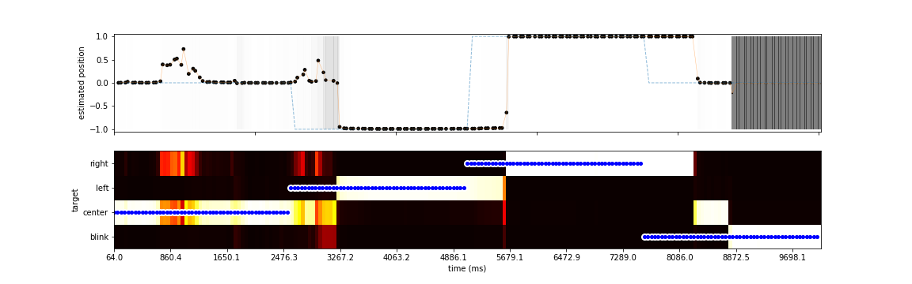

#  catch the eye

this simple framework uses a deep learning network to find the eye in the image of a face (for instance the image that will be taken by a WebCam) and then to predict the direction of the gaze


***Figure:*** *In a rapid succession of grabbed frames, we report the prediction of LeCheapEyeTracker when showing the target at different locations (white and blue dot)*


# to look at:

* https://pytorch.org/docs/stable/torchvision/models.html#object-detection-instance-segmentation-and-person-keypoint-detection instead of dlib
* https://github.com/laurentperrinet/ActiveVision/blob/master/dev/2020-04-12_HOLO_server.py

## install

````
pip3 install --user easydict
git clone https://github.com/laurentperrinet/CatchTheEye
cd CatchTheEye/
python3 Regard.py
````

## results

In summary, by scanning different parameters, we prove that :
 - using the GPU improves speed by a factor ~10,
 - SGD is more performant than ADAM in most cases for this problem,
 - there seem to be 2 optimal strategies, diabolo or inverted diabolo

A full output of results is in [in the output.txt txt file](output.txt)

## LICENCE

All code is released under the GPL license, see the LICENSE file.

The database files of faces are distributed for the learning of the network, but should not be re-used outside this repository.

The precise license is https://creativecommons.org/licenses/by-nc-nd/4.0/
